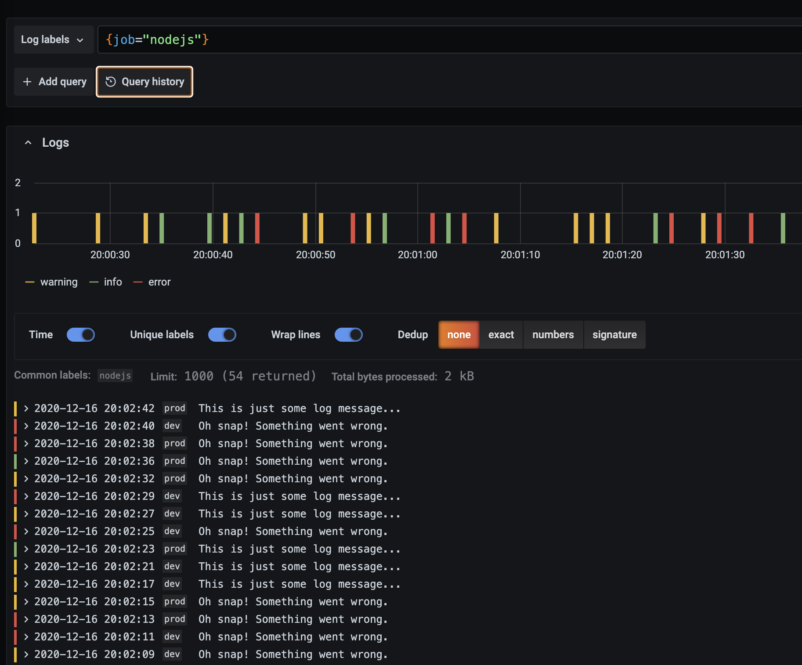

# Node.js + Loki + Grafana

This is a simple playground for sending random logs from a Node.js service to Loki and then querying
them using Grafana.

```
 Node.JS      (:8080)        Loki         (:3100)       Grafana        (:3000)
+-------------------+       +-------------------+      +---------------------+
|                   |       |                   |      |                     |
|   Sends logs      |       |                   |      |  Query with         |
|   using Winston   |------->                   <------|  LogQL              |
|                   |       |                   |      |                     |
|                   |       |                   |      |                     |
+-------------------+       +-------------------+      +---------------------+
```



---

## How are the logs sent?

The logs are sent using [winston-loki](https://github.com/JaniAnttonen/winston-loki) which exposes a transform that pushes them directy to the `/loki/api/v1/push` API endpoint of Loki.

## Start

```bash
# Starts the following services:
# - Node.js - http://localhost:8080 
# - Loki - http://localhost:3100 
# - Grafana - http://localhost:3000 
$ docker-compose up
```

Visit [http://localhost:3000/explore](http://localhost:3000/explore) for playing around with the metrics.
(The service is scraped for random metrics every 1s for more frequent data)

---

## Development

```bash
# Starts the Node.js service and restarts it on changes
$ yarn dev

# Starts Loki and Grafana
$ docker-compose up loki grafana